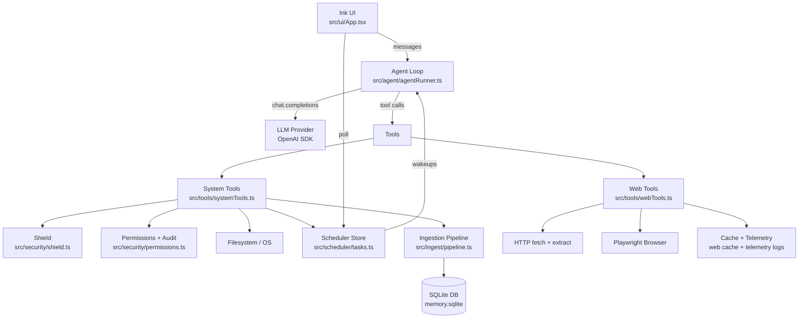

# Web-Scout (agentic-me-bot)

A local-first personal agent that can:

- chat in a terminal UI (Ink + React)
- browse the web (Playwright + hardened web search + research bundling)
- run local tools safely (Shield + persistent permissions + audit log)
- schedule recurring tasks (cron/interval, missed-run policies, per-task timezone)
- ingest documents (PDF/DOCX/HTML/MD/TXT → chunks → embeddings) and answer with citations (PDF page numbers when available)

The default LLM client in this repo is OpenAI and the tool loop is implemented as a ReAct-style “tool-call → observe → continue” cycle.

---

## Key Features

### Safety + Permissions (Shield)

- Blocks unsafe commands and paths by default (`src/security/shield.ts`).
- If Shield blocks a path/tool, the UI asks you (human-in-the-loop) instead of hard-blocking.
- Supports persistent rules (“always allow this folder/tool”, “always deny…”) + audit log:
  - `~/.web-scout/permissions.json`
  - `~/.web-scout/audit.jsonl`

### Web Tools (hardened)

- `search_web`: reliable web search (no Google CAPTCHA dependency).
- `research_web`: search + fetch top sources + return extracted text for better summaries/comparisons.
- Multi-provider fallback + caching + rate-limit backoff + telemetry:
  - cache: `~/.web-scout/cache/web/`
  - telemetry: `~/.web-scout/telemetry/web.jsonl`

### Scheduler + `/tasks` UI

- Cron support (5-field: `m h dom mon dow`), interval schedules, one-time schedules.
- Missed-run policies: `skip | catch_up_once | catch_up_all`.
- Local commands to manage tasks without the LLM:
  - `/tasks list|show|enable|disable|delete|update`

### Document Ingestion + Citations

- `ingest_document` tool indexes documents into `~/.web-scout/memory.sqlite` with embeddings.
- `memory_search` returns the most relevant chunks and includes metadata:
  - source title / URL
  - PDF page number (when ingestion extracted per-page text)

### UX

- Cleaner rendering (labels align correctly; markdown is rendered in terminal).
- Optional tool-call trace cards: `/trace on`
- Stop/cancel current run: `/stop`
- Dry-run mode (tools don’t execute side effects): `/dryrun on`

---

## Architecture



---

## Getting Started

### Prerequisites

- Node.js 18+
- An OpenAI API key (set `OPENAI_API_KEY`)

### Install

If PowerShell blocks `npm` scripts on your machine, run install from `cmd.exe`:

```bat
cmd /c "npm install"
```

### Configure

Create `.env`:

```env
OPENAI_API_KEY=your_key_here
```

Optional:

- `WEBTOOLS_HEADLESS=false` to show the browser window
- `WEBTOOLS_CHANNEL=chrome` to use installed Chrome
- `SCOUT_DEBUG=1` or `--debug` to show internal browser/tool logs

### Run

```bat
node bin/scout.js
```

Common flags:

- `--trust-mode` (auto-approves prompts; not recommended for daily use)
- `--debug` (verbose web tool logs)

---

## Built-in UI Commands

- `exit` — quit
- `/stop` — cancel the current agent run
- `/trace on|off` — show/hide tool-call cards
- `/dryrun on|off` — run tools in dry-run mode (no side effects)

### `/tasks`

- `/tasks list`
- `/tasks show <id>`
- `/tasks disable <id>` / `/tasks enable <id>`
- `/tasks delete <id>`
- `/tasks update <id> <json>` (advanced)

Example:

```text
/tasks update 1712830000000 {"missedRunPolicy":"skip"}
```

---

## Data Storage (on your machine)

All state is stored under `~/.web-scout/`:

- `logs/` — daily chat logs (markdown)
- `MEMORY.md` — user “core memory”
- `pending_tasks.json` — scheduler tasks
- `permissions.json` — persistent permission rules
- `audit.jsonl` — allow/deny audit log
- `cache/web/` — web cache
- `telemetry/web.jsonl` — web backoff/rate-limit telemetry
- `memory.sqlite` — embeddings + ingested documents

---

## Tooling Notes

- Web searching: prefer `search_web` / `research_web` instead of navigating to Google result pages (often blocks automation).
- Research output quality: the agent loop includes a finalization pass to prevent “link dumps” and produce an actual write-up.
- PDFs:
  - `read_pdf` is a direct extractor.
  - `ingest_document` is for long-term Q&A (recommended for large PDFs).

---

## Docs

- Feature design/implementation notes: `docs/FEATURES_IMPLEMENTATION_GUIDE.md`
